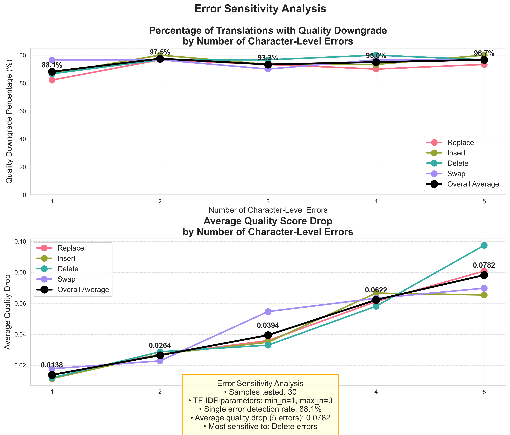
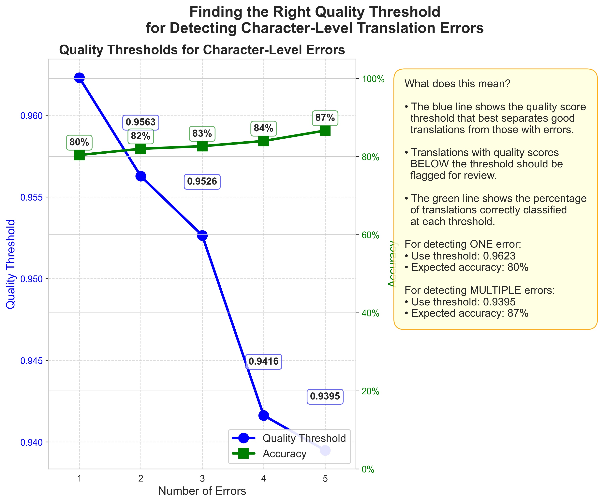
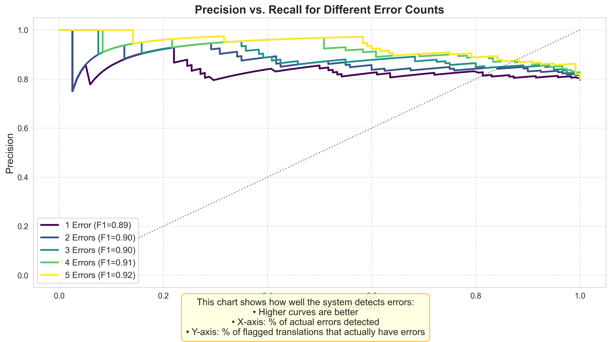

# Translation Quality Visualization Guide

This guide explains all the visualizations and data files generated when running the error sensitivity experiments. The examples below assume you've run all experiment types with the command:

```bash
python tests/run_error_experiments.py --all
```

All results are saved in the `results/error_experiments/` directory.

## 1. Baseline Experiment Files

### Visualization: `error_sensitivity_base.png`



This visualization shows:
- **Top chart**: Percentage of translations with quality downgrade by error count
- **Bottom chart**: Average quality drop by error count
- Both charts break down results by error type (replace, insert, delete, swap)

**Key insights:** 
- How reliably your quality estimator detects errors (percentage)
- How much each error type impacts the quality score (quality drop)
- Whether some error types are more detectable than others

### Data: `error_sensitivity_base_results.json`

This JSON file contains the raw data behind the baseline visualization, including:
- Error counts tested
- Downgrade percentages for each error count and type
- Average quality drops for each error count and type
- Sample-level details for further analysis

## 2. Sample Size Experiment Files

For each sample size tested (typically 15, 25, 50, 100, 500), you'll find:

### Visualization: `sample_size_test_samples_[SIZE].png`

Example: `sample_size_test_samples_50.png`

These visualizations show how the quality estimator performs with different sample sizes. Larger samples generally provide more reliable results but take longer to process.

**Key insights:**
- Whether your results stabilize at a certain sample size
- If different error types behave differently with sample size
- The minimum sample size needed for reliable results

### Data: `sample_size_test_samples_[SIZE]_results.json`

These files contain the raw data for each sample size test, allowing you to:
- Compare performance metrics across sample sizes
- Analyze statistical significance 
- Identify outliers or anomalies

## 3. TF-IDF Parameter Experiment Files

For each TF-IDF parameter combination tested:

### Visualization: `tfidf_param_test_tfidf_min[N]_max[M].png`

Example: `tfidf_param_test_tfidf_min1_max3.png`

These visualizations show how different TF-IDF parameters affect error detection. The min_n and max_n parameters control the size of n-grams used in similarity calculation.

**Key insights:**
- Which parameter combinations provide the best error detection
- Whether certain error types respond differently to parameter changes
- Optimal parameters for your specific language pair

### Data: `tfidf_param_test_tfidf_min[N]_max[M]_results.json`

These files contain the raw performance data for each parameter combination, allowing you to:
- Find the optimal parameter settings
- Compare performance across different parameter values
- Identify tradeoffs between different settings

## 4. Threshold Optimization Files

### Main Threshold Visualization: `threshold_optimization_thresholds_thresholds.png`



This is one of the most important visualizations, showing:
- **Blue line**: The optimal quality threshold for each error count
- **Green line**: The classification accuracy at each threshold
- **Right panel**: Practical guidance on how to use these thresholds

**How to use this visualization:**
1. For detecting even single errors, use the threshold shown for 1 error
2. For focusing on more significant errors, use the threshold for multiple errors
3. The accuracy percentage shows what percentage of translations will be correctly classified

### Precision-Recall Curves: `threshold_optimization_thresholds_precision_recall.png`



This visualization shows the tradeoff between precision (accuracy of flagged translations) and recall (percentage of errors caught) for different error counts.

**Key insights:**
- Higher curves indicate better performance
- The area under each curve represents overall performance
- Different error counts may show different precision-recall tradeoffs

### Basic Results: `threshold_optimization_thresholds.png`

This shows the same basic error sensitivity information as the baseline experiment, but for the sample used in threshold optimization.

### Data Files:

- `threshold_optimization_thresholds_results.json`: Basic error sensitivity results
- `threshold_optimization_thresholds_thresholds.json`: Detailed threshold data including:
  - Optimal threshold values for each error count
  - F1 scores, accuracy, precision, and recall
  - Additional classification metrics

## How to Use These Results in Your Workflow

### For Quality Control:

1. **Set Quality Thresholds**: Use the values from `threshold_optimization_thresholds_thresholds.png`:
   - For high sensitivity (catch all errors): Use the threshold for 1 error
   - For balanced approach: Use the threshold for 3 errors
   - For high precision (fewer false alarms): Use the threshold for 5 errors

2. **Optimize TF-IDF Parameters**: Check the `tfidf_param_test_*.png` files to find which parameters work best for your language pair and implement those in your quality estimation pipeline.

3. **Determine Sample Size Needs**: Review the `sample_size_test_*.png` files to determine the minimum sample size needed for reliable results in your production environment.

### For Performance Analysis:

1. Use the `error_sensitivity_base.png` to understand how different error types impact quality scores.

2. Analyze the precision-recall curves to understand the tradeoff between catching all errors and avoiding false positives.

3. Look for patterns across different error types to see if certain errors are more consistently detected than others.

## Tips for Interpretation

1. **Quality Threshold Interpretation**: A threshold of 0.98 means that translations with a quality score below 0.98 should be flagged for review.

2. **Accuracy Understanding**: If the accuracy is 85%, then 85% of translations will be correctly classified (either correctly flagged for errors or correctly passed as good).

3. **Error Type Analysis**: If "swap" errors show lower detection rates than "delete" errors, your quality estimator is more sensitive to missing content than reordered content.

4. **Comparing Visualizations**: When comparing results across experiments, look for consistent patterns rather than exact values, as sample variation can affect specific numbers.

## Customizing Visualizations

If you need different visualizations or want to modify the existing ones:

1. Edit the visualization functions in `tests/error_experiments.py`
2. Adjust color schemes, labels, or explanatory text 
3. Add custom annotations or highlight specific values of interest
4. Run the experiments again to generate updated visualizations 